# 🇵🇷 Dominó Boricua — FiveM

Dominó en parejas **estilo Puerto Rico** para FiveM, compatible con **QBCore**, **Qbox** y **ESX** (también corre standalone, sin apuestas).

- Interfaz moderna **liquid glass**: paneles de cristal translúcido con brillo, cápsulas y fichas brillantes, con los colores de la bandera.
- **Panel de admin** (`/dominoadmin`): colocas mesas en cualquier zona del mapa con una vista previa fantasma de la mesa y sus 4 sillas. Se guardan solas.
- **Mesa física con vida**: los jugadores se sientan en las sillas, los bots aparecen como NPCs sentados y las fichas se ven **en 3D sobre la mesa**, con las manos paradas frente a cada silla y una flecha sobre el que le toca.

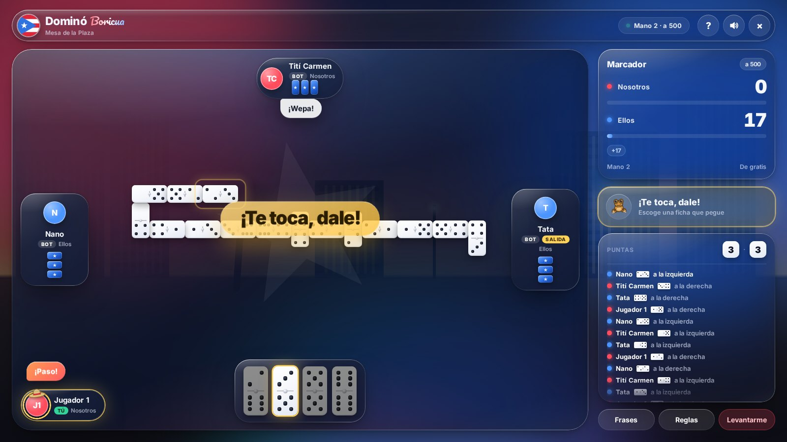

| Lobby de la mesa | ¡Capicú! |
| --- | --- |
| 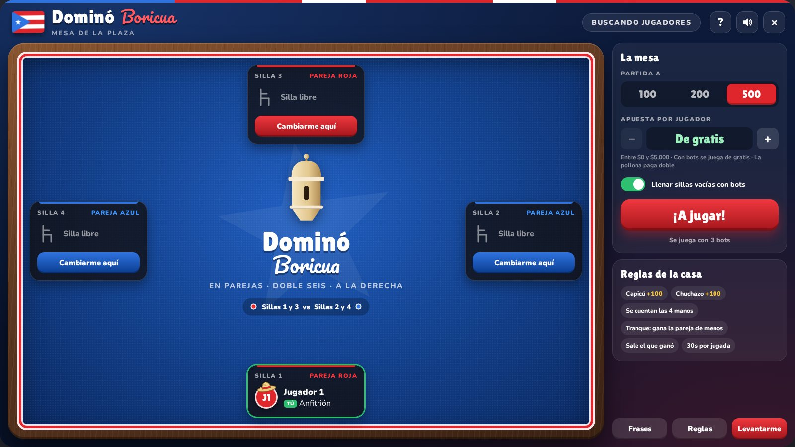 | 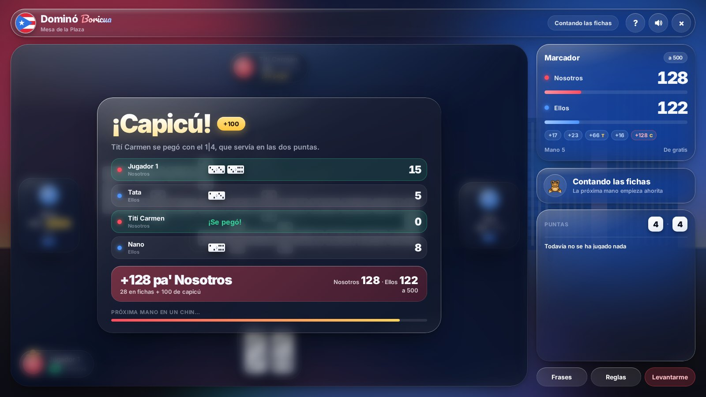 |

| Panel de admin | Nueva mesa |
| --- | --- |
| 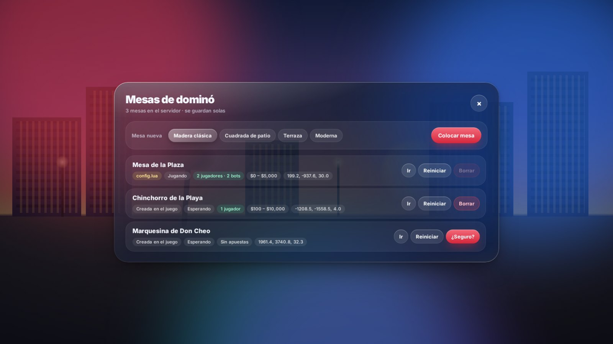 | 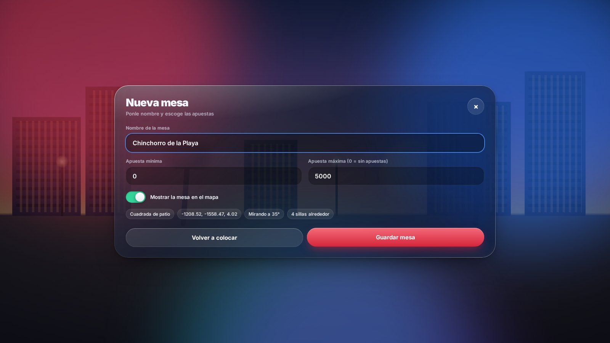 |

> Las capturas son de la interfaz real con un fondo de ejemplo detrás; en el juego, detrás del cristal se ve tu personaje sentado en la mesa.

<details>
<summary><b>Ver todas las ventanas</b></summary>

| Lobby solo con bots | Salida con la cochina |
| --- | --- |
| 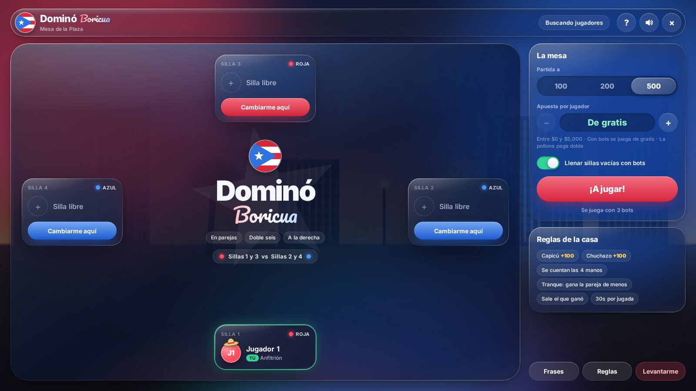 | 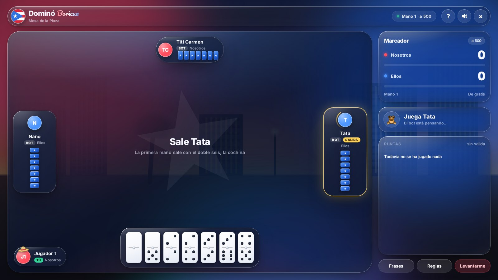 |

| Escoger la punta | Frases rápidas |
| --- | --- |
| 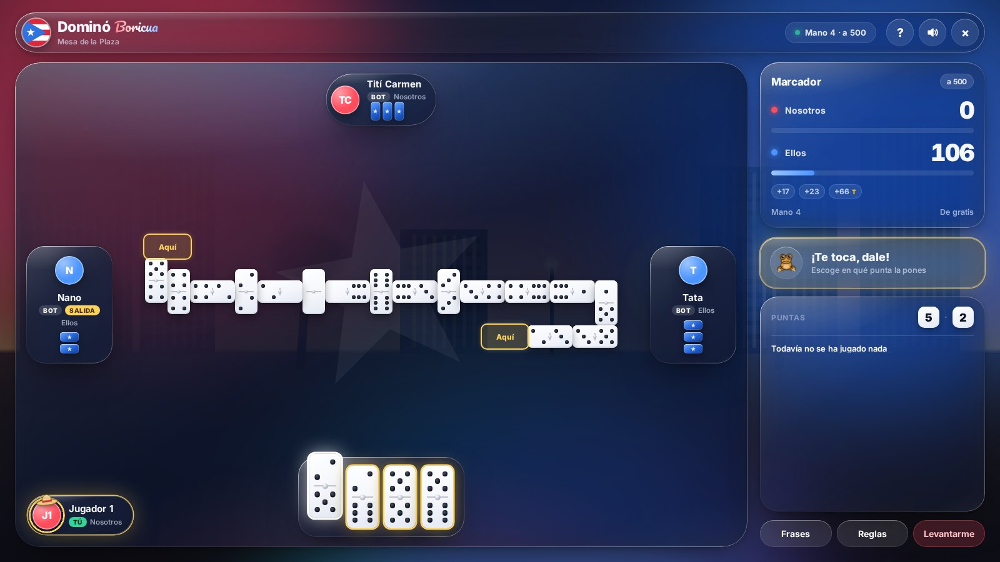 | 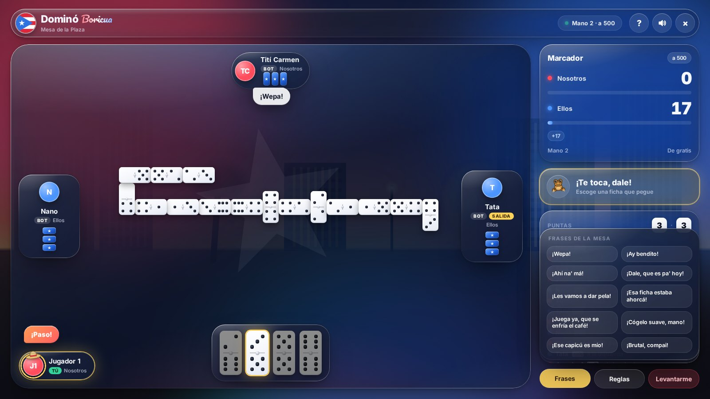 |

| ¡Se trancó! | Fin de partida |
| --- | --- |
| 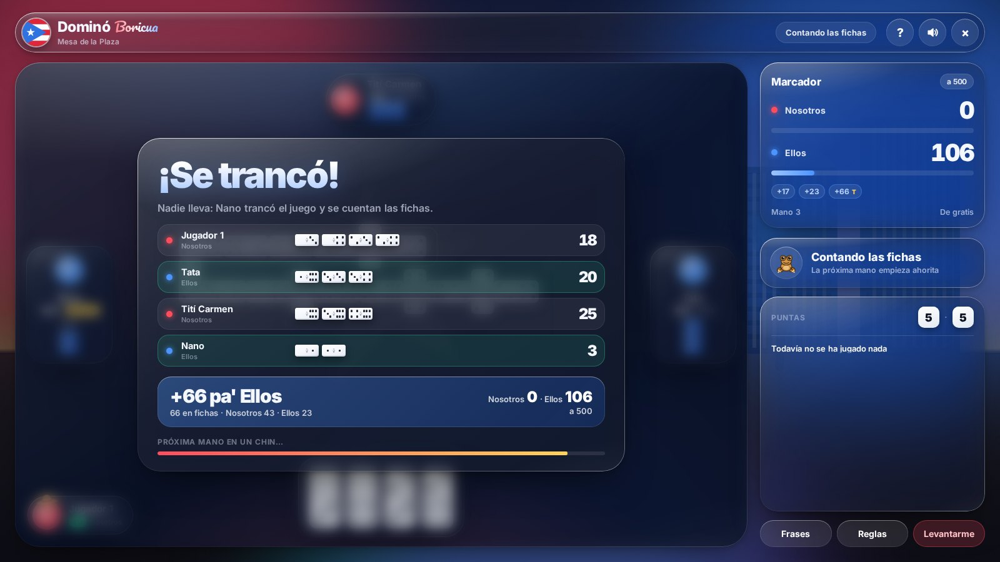 | 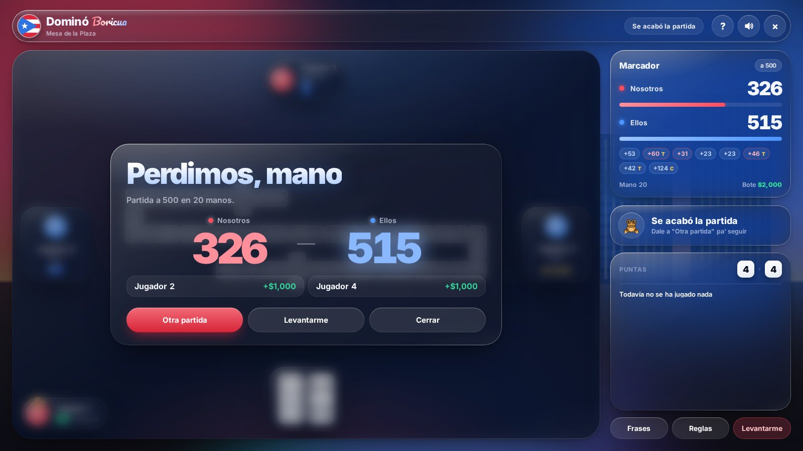 |

| ¡Pollona! | Reglas |
| --- | --- |
| 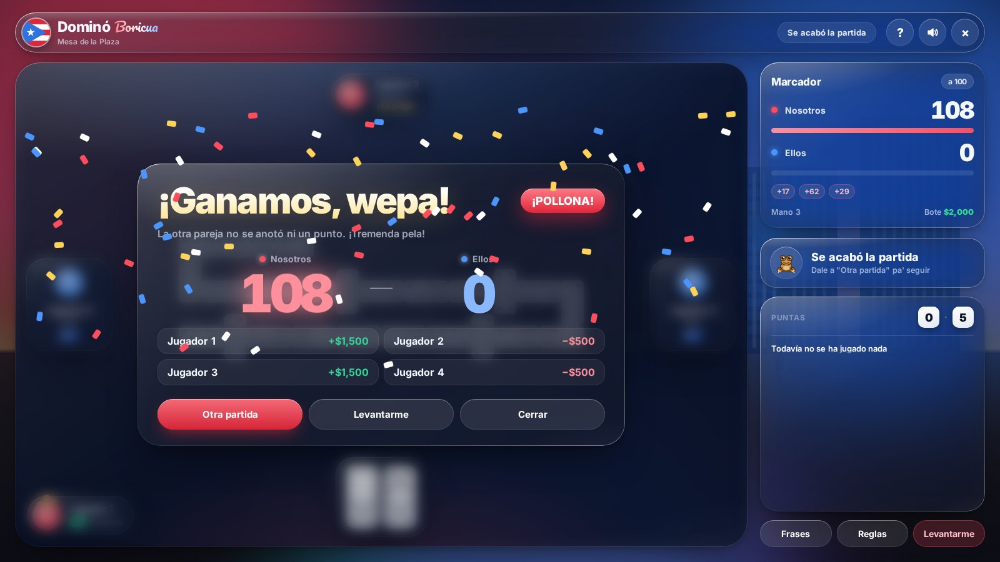 | 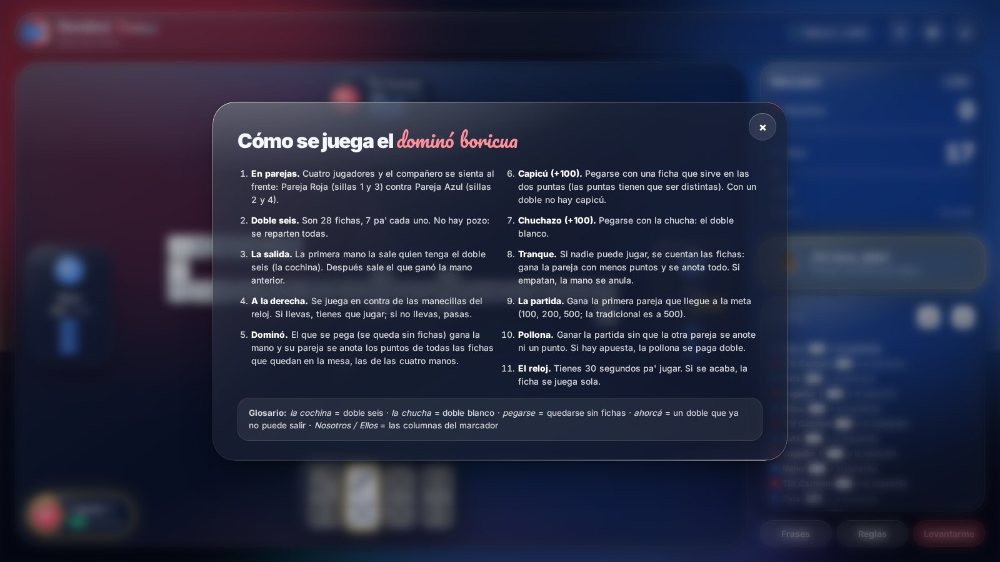 |

| Modo colocar mesa (admin) |
| --- |
| 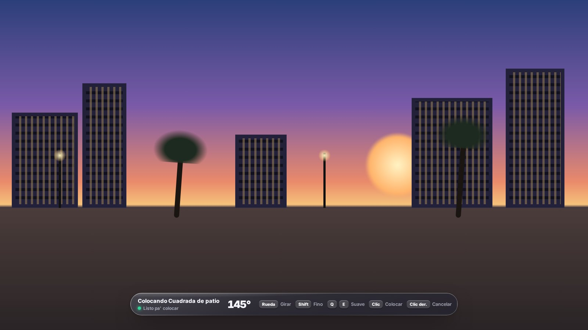 |

</details>

---

## Reglas del dominó boricua (lo que implementa el script)

| Regla | Cómo funciona |
| --- | --- |
| **Parejas** | 4 jugadores. El compañero se sienta al frente: Pareja Roja (sillas 1 y 3) contra Pareja Azul (sillas 2 y 4). |
| **Fichas** | Doble seis: 28 fichas, 7 por jugador. No hay pozo. |
| **La salida** | La primera mano de cada partida sale obligada con el **doble seis** ("la cochina"). Después **sale el que ganó la mano** (configurable para que la salida rote). |
| **Dirección** | Se juega **a la derecha** (en contra de las manecillas del reloj). |
| **Obligación** | Si llevas, tienes que jugar. Si no llevas, pasas (el pase es automático). |
| **Dominó** | El que se pega (se queda sin fichas) gana la mano y su pareja se anota **los puntos de todas las fichas que quedan en las 4 manos** (configurable: solo las de la pareja contraria). |
| **Capicú** | Pegarse con una ficha que sirve en las dos puntas: **+100**. No aplica con dobles. Por defecto las puntas deben ser distintas. |
| **Chuchazo** | Pegarse con la chucha (doble blanco): **+100**. |
| **Tranque** | Si nadie puede jugar, se cuentan las fichas: gana **la pareja con menos puntos** y se anota todo. Si empatan, **la mano se anula** (ambas cosas configurables). |
| **Partida** | A **500** puntos (el anfitrión puede escoger 100, 200 o 500). |
| **Pollona** | Ganar la partida sin que la otra pareja se anote ni un punto. Si hay apuesta, **la pollona se paga doble**. |
| **Reloj** | 30 segundos por jugada; si se acaba, la ficha se juega sola. |

Glosario que usa la interfaz: *la cochina* (doble seis), *la chucha* (doble blanco), *pegarse* (quedarse sin fichas), *ahorcá* (un doble que ya no puede salir).

---

## Características

- **Servidor autoritativo**: el reparto, las jugadas, los pases, el tranque y el conteo se validan en el servidor. Nadie ve las fichas de los demás hasta el conteo.
- **Multi-framework** con detección automática: `qbx_core`, `qb-core`, `es_extended` o standalone.
- **ox_target / qb-target** automáticos; si no hay target, texto 3D y tecla **E**.
- **Mesas creadas por admins** con vista previa, guardadas en `data/tables.json`, sincronizadas al momento con todos los jugadores (sin reiniciar el recurso).
- **Sillas alrededor de la mesa** calculadas con las medidas reales del modelo, y cada jugador se sienta en la suya.
- **Mesa 3D**: el tablero en culebra se dibuja sobre la mesa física (con los puntitos de cerca), cada jugador tiene sus fichas paradas al frente y hay una flecha dorada sobre el que le toca.
- **Bots** con IA (sueltan fichas pesadas, cuidan los dobles, tranquean al contrario cuando saben que no lleva y no ahogan al compañero) que se sientan como NPCs. Si alguien se va a mitad de partida, un bot coge su silla.
- **Apuestas**: se cobra a todos o a nadie al empezar, el bote se reparte a la pareja ganadora, comisión opcional de la casa y reembolso si se apaga el recurso o un admin reinicia la mesa. Con bots en la mesa se juega de gratis.
- **Interfaz liquid glass**: tablero en culebra con esquinas, marcador "Nosotros / Ellos" con barras de progreso, registro de jugadas, puntas, frases rápidas ("¡Wepa!", "¡Ay bendito!", "¡Esa ficha estaba ahorcá!"…), anillo de tiempo alrededor del avatar y gritos de ¡Capicú!, ¡Chuchazo!, ¡Se trancó! y ¡Pollona!.
- **Sonidos sintetizados** (sin archivos): golpe de ficha, un *¡co-quí!* cuando te toca y un güiro cuando ganas.
- Fuentes incluidas, así que la interfaz funciona sin conexión.

---

## Instalación

1. Descarga el repositorio y pon la carpeta en `resources` con el nombre **`domino-boricua`**.
2. En `server.cfg`, después de tu framework y tu target:

   ```cfg
   ensure qb-core        # o qbx_core / es_extended
   ensure ox_target      # opcional (o qb-target)
   ensure domino-boricua
   ```

3. Entra al juego como admin, escribe `/dominoadmin` y coloca tu primera mesa.

**Requisitos**: servidor FiveM reciente con **OneSync** (el servidor valida la distancia a la mesa; sin OneSync esa validación se omite). El recurso necesita poder escribir en su carpeta `data/`.

---

## Crear mesas en el juego (admin)

1. `/dominoadmin` abre el panel con todas las mesas del servidor.
2. Escoge el modelo de mesa (solo salen los que existen en tu build del juego) y dale a **Colocar mesa**.
3. Aparece la mesa fantasma con sus 4 sillas siguiendo tu mira:
   - **Rueda del mouse**: girar (con **Shift** gira fino), **Q / E**: girar suave
   - **Clic**: colocar · **Clic derecho**, **Backspace** o **ESC**: cancelar
4. Ponle nombre, apuesta mínima y máxima (0 = sin apuestas) y si sale en el mapa. **Guardar mesa**.

Desde el panel también puedes **ir** a cualquier mesa, **reiniciarla** (devuelve las apuestas) o **borrarla** (pide confirmación). Las mesas de `config.lua` no se pueden borrar desde el panel.

**Permisos**: tiene acceso quien tenga el ACE `command.dominoadmin` o `dominoboricua.admin` (los admins con `add_ace group.admin command allow` ya lo tienen). En QBCore y ESX también sirven los grupos de `Config.Admin.groups` (`admin`, `god`, `superadmin`).

```cfg
# ejemplo: darle el panel a un grupo propio
add_ace group.moderador dominoboricua.admin allow
```

---

## Configuración (`config.lua`)

| Opción | Descripción |
| --- | --- |
| `Config.Framework` | `'auto'`, `'qbcore'`, `'qbox'`, `'esx'` o `'standalone'`. |
| `Config.Target` | `'auto'`, `'ox_target'`, `'qb-target'` o `'none'` (tecla E). |
| `Config.Admin` | Comando del panel, ACE y grupos con permiso, tope de apuesta y distancia mínima entre mesas. |
| `Config.Betting` | Cuenta (`'cash'` o `'bank'`; en ESX `'cash'` se convierte a `'money'`), salto del selector, comisión de la casa y si la pollona paga doble. |
| `Config.Rules` | Metas disponibles, salida con doble seis, quién sale después (`'winner'` / `'rotate'`), si se cuentan las 4 manos, bonos de capicú y chuchazo, modo de tranque (`'team'` / `'player'`) y qué pasa si empatan (`'annul'` / `'starter'`). |
| `Config.Timing` | Segundos por jugada, velocidad de los bots, pausa entre manos. |
| `Config.Bots` | Activar bots, sus nombres (Don Cheo, Tití Carmen, Papo, Wiso…) y los modelos de los NPCs que se sientan. |
| `Config.Props` | Modelo de mesa y silla por defecto, lista de modelos para el panel (`tableModels`), separación de las sillas y escenario de sentarse. |
| `Config.World` | Mesa 3D: distancia de dibujo, distancia de los puntitos, fichas en la mano, flecha de turno y medidas para mesas del mapa (sin prop). |
| `Config.Phrases` | Frases rápidas de la mesa. |
| `Config.Tables` | Mesas fijas (opcional; lo normal es crearlas con `/dominoadmin`). |

### Mesas fijas en `config.lua`

Si prefieres dejarlas en el archivo, párate donde quieres el **centro** de la mesa y escribe `/dominocoords` (la silla 1 queda a tu espalda):

```lua
{
    id = 'chinchorro_playa',        -- único
    label = 'Chinchorro de la Playa',
    coords = vector4(-1208.50, -1558.50, 4.00, 35.0),
    spawnProps = true,               -- false si ya hay una mesa del mapa en ese sitio
    tableModel = 'prop_table_04',
    chairModel = 'prop_table_04_chr',
    blip = true,
    minBet = 100,
    maxBet = 10000,                  -- 0 = sin apuestas en esta mesa
},
```

> La mesa de ejemplo en Legion Square es un punto de partida: revisa que quede bien en tu mapa o bórrala del config y crea las tuyas con el panel.

### Rendimiento de la mesa 3D

Las fichas se dibujan solo cuando estás a menos de `Config.World.drawDistance` (15 m) de una mesa con partida, y los puntitos solo a menos de `pipsDistance` (4 m). Con el tablero lleno y de cerca son unas 350 llamadas de dibujo por frame; si tu servidor está justo de rendimiento, baja esas distancias o pon `Config.World.enabled = false`.

---

## Cómo se juega en el servidor

1. Acércate a la mesa y usa el target (o **E**) → se abre la mesa.
2. Escoge una silla y tu personaje se sienta. El primero que se sienta es el **anfitrión** (la pava 👒) y escoge la meta, la apuesta y si se llenan las sillas con bots.
3. **¡A jugar!** Cuando te toca, las fichas que pegan brillan en dorado y el anillo de tu avatar marca el tiempo. Si una ficha sirve en las dos puntas, escoges dónde ponerla.
4. **ESC** cierra la ventana pero te quedas sentado viendo la mesa en 3D: **E** para volver a la mesa, **X** para levantarte.

### Comandos

| Comando | Uso |
| --- | --- |
| `/domino` | Abre la mesa más cercana (o la tuya si estás sentado). Se le puede asignar tecla con `Config.OpenKey`. |
| `/dominoadmin` | (Admin) Panel para crear, borrar, reiniciar e ir a las mesas. |
| `/dominocoords` | Imprime la línea `coords = vector4(...)` de tu posición. |
| `/dominoreset [id]` | (Consola/admin) Reinicia una mesa o todas y devuelve las apuestas. |

---

## Estructura

```
domino-boricua/
├── fxmanifest.lua
├── config.lua
├── data/                 # tables.json: las mesas que crean los admins
├── shared/
│   ├── locale.lua        # textos de las notificaciones
│   └── domino.lua        # lógica pura del juego (sin natives)
├── bridge/
│   ├── server.lua        # QBCore / Qbox / ESX: nombre, dinero, permisos, notificaciones
│   └── client.lua        # notificaciones y detección de target
├── server/
│   ├── bot.lua           # IA de los bots
│   ├── main.lua          # mesas, turnos, conteo, apuestas, estado público
│   └── admin.lua         # panel de admin
├── client/
│   ├── main.lua          # mesas, props, sillas, target, NUI
│   ├── world.lua         # fichas 3D, manos, flecha de turno y bots sentados
│   └── admin.lua         # modo colocar con la mesa fantasma
└── html/                 # interfaz liquid glass (HTML/CSS/JS sin dependencias)
    └── fonts/            # Inter y Pacifico (SIL OFL)
```

### Seguridad

El servidor solo acepta jugadas válidas en tu turno, fichas que de verdad tienes y cambios de la mesa si eres el anfitrión. Los eventos del panel verifican permisos en el servidor y limpian los datos (nombre, apuestas, coordenadas y modelo) antes de guardar.

---

## Créditos

- Fuentes: [Inter](https://fonts.google.com/specimen/Inter) y [Pacifico](https://fonts.google.com/specimen/Pacifico), bajo la SIL Open Font License (licencias en `html/fonts/`).
- Reglas basadas en el dominó de parejas que se juega en Puerto Rico: partida a 500, capicú y chuchazo de 100, tranque por menos puntos y pollona.
